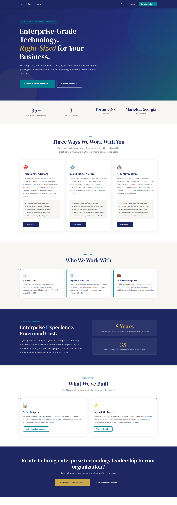
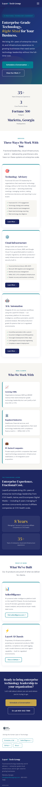

# layer8-site

Marketing site for **[layer8techgroup.com](https://layer8techgroup.com)** —
Layer8 Tech Group, a fractional technology leadership and AI advisory firm
(Marietta, Georgia).

Self-contained static HTML — no framework, no build step. Deploys to
layer8techgroup.com via **Cloudflare Pages** (GitHub integration — auto-builds
on push to `main`; serves at both apex and `www`).

## Structure

| Path | Page |
|------|------|
| `index.html` | Homepage — services-led (Advisory · Infrastructure · Automation) |
| `advisory/` | Technology Advisory (fractional CIO/CTO, infrastructure, automation) |
| `about/` | About Layer8 + AI governance |
| `ai-services/` | AI services (incl. `ai-services/ocaas/`) |
| `transaction-intelligence/` | Product pages — Exit Readiness, Due Diligence, Franchise, Deal Room *(kept for SEO; the seller-facing products now live on [sellerdiligence.com](https://sellerdiligence.com))* |
| `assets/css/main.css` | Shared design system (navy/teal/gold tokens) |
| `assets/js/main.js` | Nav, dropdown, mobile menu, scroll reveal |
| `_redirects` | 301s for legacy short URLs → canonical two-level paths |
| `docs/screenshots/` | Reference screenshots (below) |

## Screenshots

### Homepage — desktop

### Homepage — mobile

### Deal Room product page

Desktop and mobile captures live at
[`docs/screenshots/deal-room-desktop.png`](docs/screenshots/deal-room-desktop.png)
and
[`docs/screenshots/deal-room-mobile.png`](docs/screenshots/deal-room-mobile.png).
