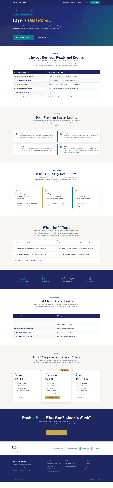
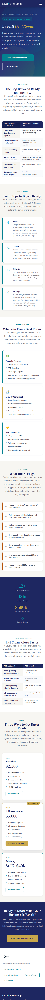

# Layer8 Deal Room

**Seller Intelligence Platform** — the seller-side product in the Layer8 Transaction Intelligence suite. Know what your business is worth (and what's holding it back) before talking to anyone: get organized, AI-reviewed, and buyer-ready before the conversation starts.

- **Live page:** https://www.layer8techgroup.com/transaction-intelligence/deal-room/
- **Source:** [`index.html`](./index.html)
- **Intake:** https://intake.layer8techgroup.com/deal-room/
- **Demo:** https://demo.layer8techgroup.com

## Page sections

1. Nav
2. Hero — *Layer8 Deal Room* / Seller Intelligence Platform
3. The Problem — what SMB sellers have vs. what buyers expect
4. How It Works — four-step process (Assess → Upload → AI Review → Package)
5. What's in Every Deal Room — Financial / Legal & Operational / Deal Documents
6. What the AI Flags — 7 deal-risk items the AI Chassis surfaces
7. Stats bar — 12+ · 48hr · $500K+ · 8
8. For Brokers — Without vs. With Layer8
9. Pricing — Snapshot $2,500 · Full Assessment $5,000 · Advisory $15K–$40K
10. CTA
11. Footer

## Screenshots

### Desktop (1440px)

### Mobile (390px)

